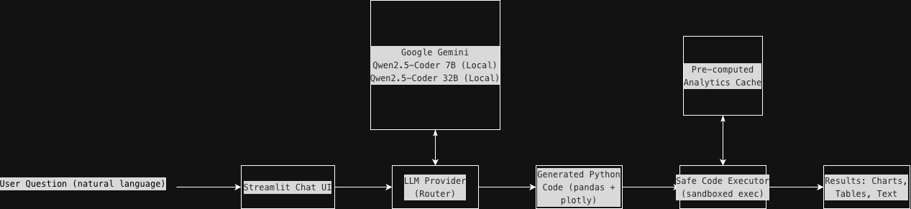
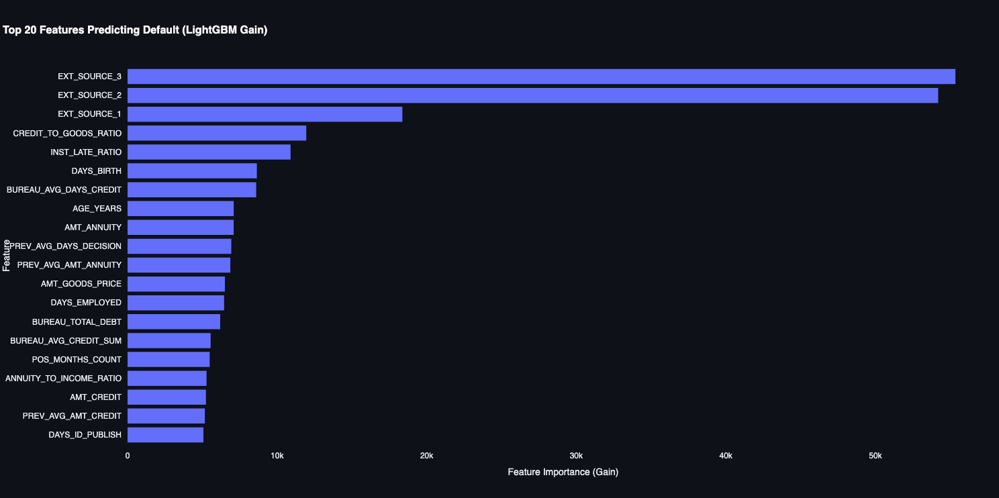

# Home Credit Data Analytics Agent

A natural language "Talk-to-Data" analytics agent built on top of the [Home Credit Default Risk](https://www.kaggle.com/c/home-credit-default-risk) dataset. Ask questions in plain English and get back interactive charts, tables, and data-driven insights.

## Architecture



**How it works:** The LLM interprets the user's natural language question, generates executable Python code (pandas + plotly) tailored to the dataset, and a sandboxed executor runs that code against the pre-loaded data. If the code fails, the agent automatically retries by sending the error back to the LLM for correction.

## Quick Start

### Prerequisites

- Python 3.10+
- The Home Credit Default Risk CSV files in the project root (download from [Kaggle](https://www.kaggle.com/c/home-credit-default-risk/data))
- **For Gemini:** A Google AI API key ([get one here](https://aistudio.google.com/apikey))
- **For Local model:** No setup needed — the Qwen2.5-Coder 7B model (~4.3 GB) auto-downloads on first use OR Qwen2.5-Coder 32B model (~20 GB)

### Setup

```bash
# 1. Create and activate a virtual environment
python -m venv venv
source venv/bin/activate   

# 2. Install dependencies
pip install -r requirements.txt

# 3. Configure your LLM API key
cp .env.example .env
# Edit .env and add your GOOGLE_API_KEY (for Gemini). Local model requires no config.

# 4. Run preprocessing (one-time, ~2 minutes)
python preprocess.py

# 5. Launch the app
streamlit run app.py
```

The app will open at `http://localhost:8501`.

## Approach

### Data Ingestion & Processing

- **Primary dataset:** `application_train.csv` (307,511 loan applications with 122 columns)
- **Feature engineering:** Cleaned anomalies (e.g., DAYS_EMPLOYED sentinel values), derived human-readable features (age in years, income ratios), and aggregated per-client summaries from 5 auxiliary tables:
  - `bureau.csv` — credit bureau history (credit count, overdue amounts, active/closed status)
  - `previous_application.csv` — prior HC applications (approval rate, avg credit amount)
  - `installments_payments.csv` — payment behavior (days late, payment ratios)
  - `credit_card_balance.csv` — card usage patterns (balances, drawings, DPD)
  - `POS_CASH_balance.csv` — POS/cash loan performance (DPD, completion rates)
- **Result:** Enriched dataset with 158 features per client, saved as Parquet for fast loading

### NLP Intelligence

- **Code-generation approach:** The LLM generates Python code (pandas + plotly) rather than trying to return answers directly — this is more accurate, flexible, and auditable
- **Rich system prompt:** Includes full column schema with descriptions, dataset statistics, available pre-computed analytics, and few-shot examples for common query patterns
- **Self-correction:** If generated code fails, the error is sent back to the LLM for automatic repair (up to 2 retries)
- **Dual LLM support:** Google Gemini (cloud, fast, high quality) and Qwen2.5-Coder 1.5B (local, private, auto-downloads)

### Pre-computed Analytics

Computed once during preprocessing and cached for instant access:
- **Feature importance:** LightGBM model (AUC ~0.77) — top 30 features by gain
- **Target correlations:** Pearson correlations with the default target
- **Summary statistics:** Per-column mean, median, missing rates, distributions
- **Segment analysis:** Default rates broken down by income type, education, gender, housing, occupation, etc.

### Example of Query

🧑: What are the top features predicting default?
🤖: Model AUC: 0.7746
Top feature: EXT_SOURCE_3 (importance: 55348)


## Future Work

- **LLM dependence:** Response quality depends on the underlying LLM's code-generation ability. Gemini produces more reliable results than smaller local models — *we can add an LLM routing layer that scores query complexity and dispatches simple queries (counts, filters) to a lightweight local model while forwarding complex analytical questions to Gemini, reducing cost without sacrificing quality.*
- **No conversational memory across sessions:** Chat history is session-only (resets on page refresh). — *We can integrate a SQLite (or PostgreSQL) backend to persist chat sessions with timestamps and user IDs, and expose a sidebar "History" panel in Streamlit so users can browse, resume, or delete past conversations.*
- **Single-table focus:** While features from all tables are aggregated into the main dataset, the LLM primarily operates on the flattened view rather than raw multi-table joins — *We can load all auxiliary tables (bureau, previous_application, etc.) into the executor context as separate DataFrames and extend the system prompt with their schemas, enabling the LLM to generate multi-table joins on demand (Could fail if the model is small, need experimentation).*
- **No real-time model training:** The LightGBM model is pre-trained during preprocessing; users cannot trigger retraining from the UI — *we can add a "Retrain Model" button in Streamlit that launches a background thread running LightGBM `train()` on the current dataset, streams progress to the UI via `st.status`, and hot-swaps the cached feature-importance results once training completes.*
- **Code execution risks:** While builtins are restricted, the sandbox is not a full security boundary — intended for trusted analytical use, not adversarial inputs — *We can replace the in-process `exec()` sandbox with a subprocess-based executor using `subprocess.run()` with resource limits (timeout, memory cap via `resource` module), or containerise execution in a Docker sidecar with read-only filesystem mounts and no network access.*
- **No followup Questions:** The user can't add a followup question or request to the already answered queries - *We can add N turns chat history to the prompt to take history into consideration as well.*


